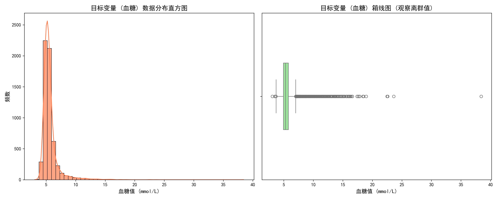
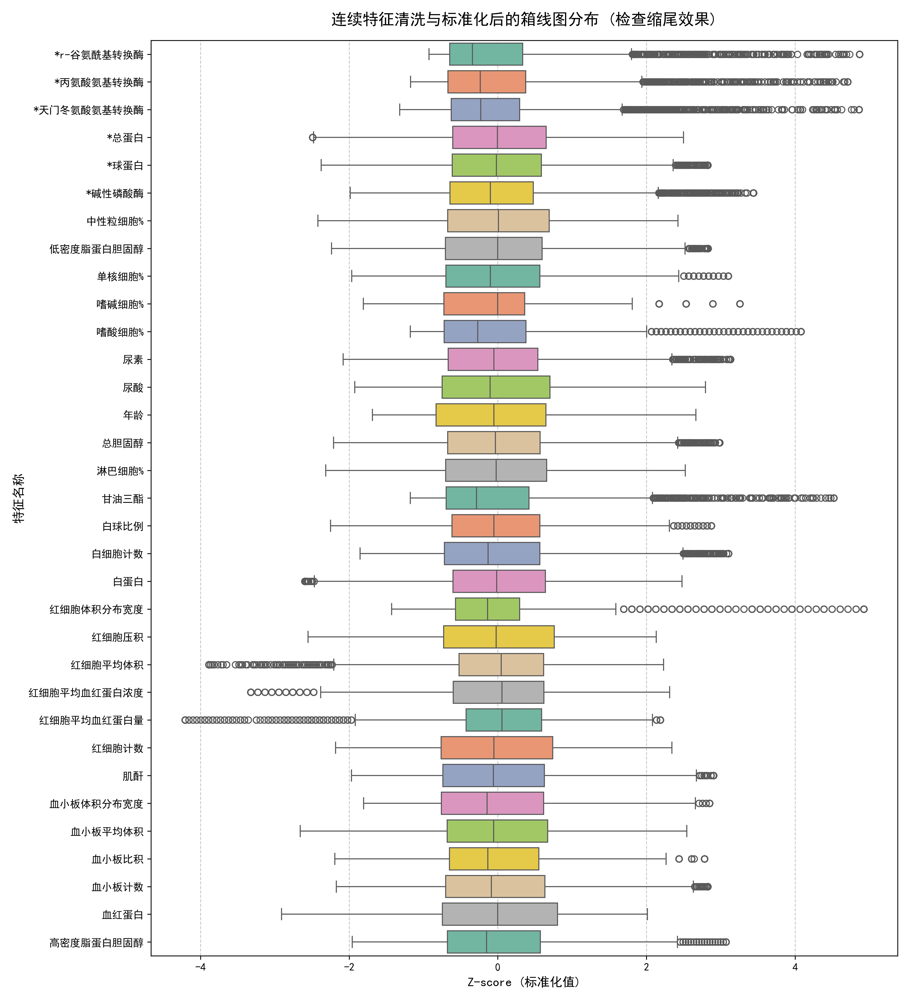

# 糖尿病风险预测：数据预处理与清洗工程报告

## 一、 数据集概况与基础清洗策略

本研究基于医疗体检数据集展开，旨在通过多维度的生理检测指标预测患者的血糖水平，并评估其患糖尿病的潜在风险。数据分为包含真实血糖标签的训练集（`with_blood.csv`）与待预测的盲测集（`within_blood.csv`）。

在正式进入特征插补与缩放之前，为了保证模型的数据纯净度并防止“数据泄露（Data Leakage）”，本阶段执行了严格的数据剥离与清洗机制：

1. **非业务逻辑特征剔除**：直接删除 `id` 和 `体检日期` 字段。这些属于系统生成的元数据，与患者的病理代谢状态无任何逻辑关联，保留它们反而会引入极大的噪声。
2. **极高缺失率特征剔除**：针对“乙肝五项”（乙肝e抗原、乙肝e抗体、乙肝核心抗体、乙肝表面抗体、乙肝表面抗原），数据勘探发现其缺失率极高（>75%）。从临床医学角度来看，乙肝病毒感染与糖尿病等代谢性疾病的直接病理关联较弱。强行使用算法对超过四分之三的空白数据进行填补，等同于“无中生有”，因此本研究果断将其进行物理删除以降低特征矩阵的稀疏度。
3. **分类变量编码**：对 `性别` 特征进行 0/1 整数编码（男：1，女：0），针对训练集中极少量的性别缺失样本，采用统计学众数（Mode）进行安全填补。
4. **因变量前置隔离与对齐**：将目标变量 `血糖` 提前从训练特征中剥离，使其**绝对不参与**后续特征端的缺失值插补、异常值计算和标准化处理，从根本上杜绝了利用目标变量反向污染特征空间的泄露风险。同时，强制测试集的列名与顺序与训练集完全对齐，保障后续机器学习框架的稳定运行。

---

## 二、 目标变量（血糖）分布勘探

在处理自变量之前，我们首先对隔离出的因变量（血糖）进行了深度的统计学与可视化分析，以指导后续的建模策略。

### 血糖分布现象解读
从生成的分布直方图与箱线图中可以清晰地观察到，医疗体检数据呈现出极其典型的**右偏态长尾分布（Right-Skewed Distribution）**：
* 绝大多数受检者的血糖集中在 4.0 ~ 6.0 mmol/L 的健康或亚健康窄带内，形成极高的频数波峰。
* 尾部向右侧长长拖拽，箱线图显示存在大量统计学意义上的“离群值”（Outliers），最高值甚至逼近 40 mmol/L。
* **临床合理性**：这种长尾现象完全符合真实的医疗客观规律。这些离群点并非记录错误，而是明确指示了数据集中包含着相当比例的中重度糖尿病患者。这也为后续回归建模阶段采用对数平滑（Log1p）提供了强有力的数据支撑。

*注：目标变量呈现显著的右偏态分布，箱线图右侧密集的散点代表了数据集中蕴含的高危糖尿病患者群体。*

---

## 三、 缺失值多变量插补（KNN Imputation）

对于保留下来的肝功能、肾功能及血脂代谢等核心连续型特征，数据集中存在不同程度的缺失。

* **痛点与方法选择**：人体的各项生理指标并非孤立存在，往往具有复杂的生理共变关系（例如某种肝脏损伤会导致多项转氨酶集体飙升）。传统的均值（Mean）或中位数（Median）填充会生硬地切断这种特征间的协方差结构。
* **处理逻辑**：本研究引入了 **K近邻（KNN）多变量高级插补法（设置 K=5）**。算法会在多维特征空间中计算欧氏距离，寻找与该缺失样本生理指标最接近的 5 个有效样本，利用它们的真实检测值进行加权平均来估算缺失值。
* **隔离防泄露**：KNN 拟合器（Imputer）**严格限定仅在训练集上进行 Fit（特征空间学习）**，提取出空间分布规律后，再去 Transform（转换）训练集和测试集。这保证了测试集对模型始终处于“未见”的客观状态。

---

## 四、 异常值处理：3σ 原则与分位数缩尾（Winsorization）

处理医疗特征异常值的核心难点在于：既要消除仪器误差带来的数值爆炸，又绝对不能抹杀重度患者的“病理信号”。

1. **异常边界精准界定**：本研究摒弃了简单的粗暴删除，而是遍历所有连续特征，严格采用统计学 **3σ 准则（|x - μ| > 3σ）** 来界定异常触发线。
2. **盖帽法缩尾压制**：一旦检测到越界，采用 **1% 与 99% 的分位数截断策略（Winsorization）**。将高于 99% 分位数的极高值强制压制到 99% 临界边界，低于 1% 分位数的极低值抬升至 1% 边界。
3. **规则一致性约束**：计算 3σ 的均值（μ）、标准差（σ）以及 1% 和 99% 的分位数临界点时，**全部强制来源于训练集**。测试集在进行缩尾时，直接代入训练集的这些边界参数。这一铁律有效防止了测试集自身数据分布对预处理规则的干扰。

---

## 五、 特征空间标准化（Z-score Normalization）与最终检查

鉴于各项体检指标的量纲和数量级差异巨大（例如红细胞计数通常在个位数波动，而碱性磷酸酶可能高达数百），直接送入模型会导致梯度下降困难或距离度量失效。

* **处理逻辑**：采用 Z-score 标准化：`Z = (x - μ_train) / σ_train`。同样，测试集的缩放严格调用训练集的均值和标准差。为防止计算异常，代码中对标准差极小值（接近 0）进行了容错处理。

### 清洗效果可视化验证
经过上述插补、缩尾与标准化后，我们对所有连续特征绘制了水平箱线图进行全局复检。

*注：经过 3σ 缩尾与 Z-score 标准化后，所有特征的量纲被完美统一到 0 均值附近。同时，极端的离散值已被成功压制在合理的边界内，既保留了病态特征的高低位区分度，又为后续的线性回归与树模型训练铺平了道路。*