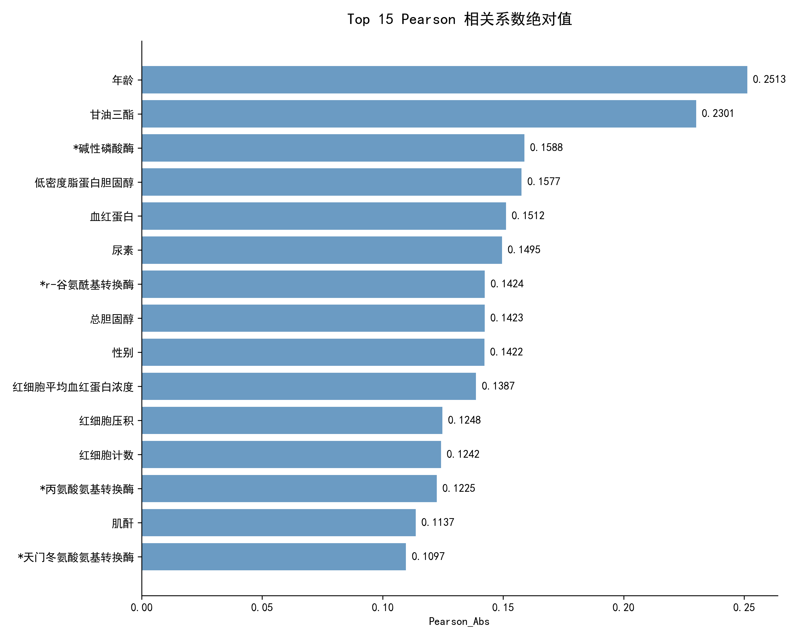
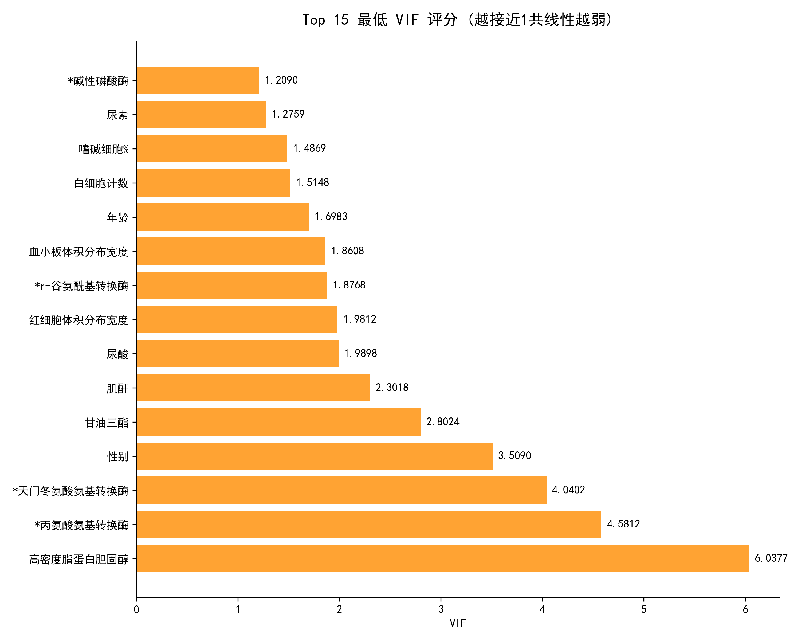
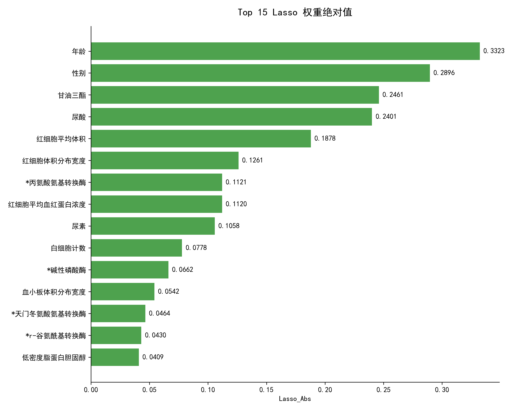
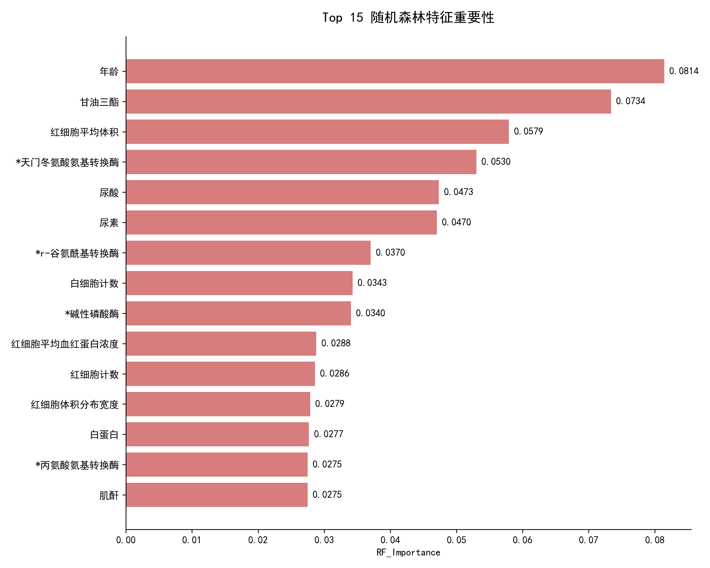
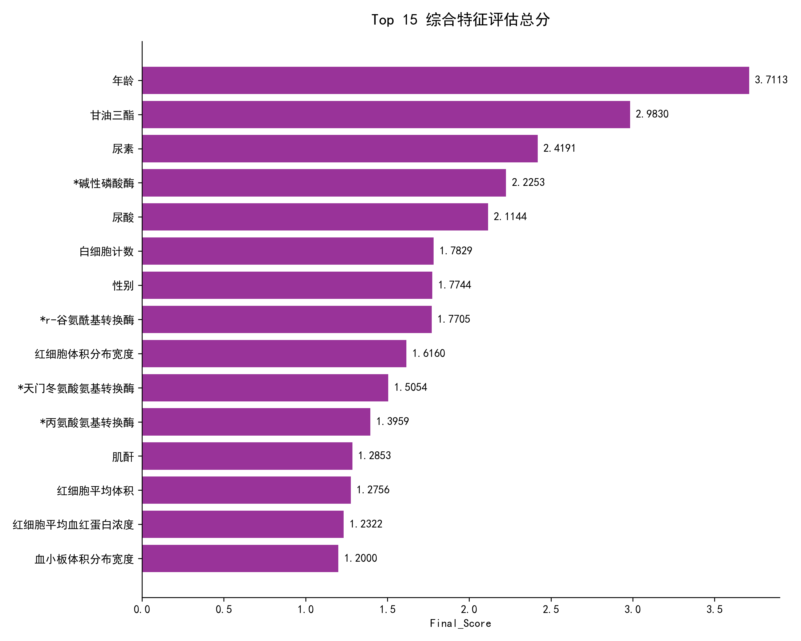
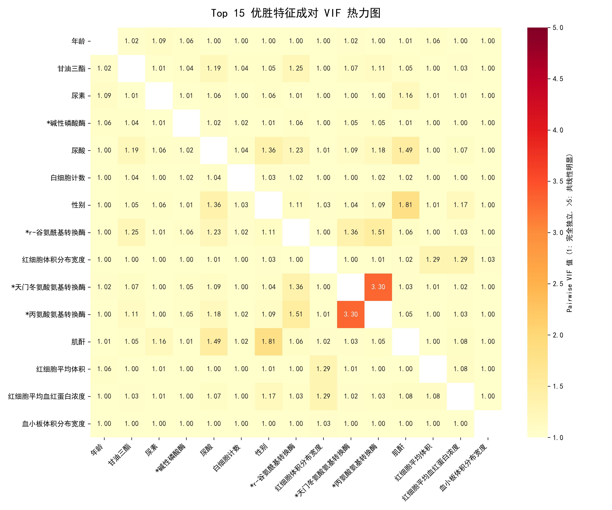

# 糖尿病风险预测：高维特征联合降维与优选报告

## 一、 特征工程与筛选机制概述

经过严格的数据清洗与预处理，我们获得了包含数十个生理指标的纯净特征矩阵。然而，在医疗数据建模中，直接将高维特征全部“喂”给模型往往会导致严重的“维度灾难”。过多的特征不仅会呈指数级增加计算成本，更会引入大量冗余信息与噪声，导致模型陷入过拟合的陷阱。

为了提升模型的预测稳定性、降低过拟合风险，并增强结果的临床医学解释性，本研究构建了一套严密的**四重联合评估机制**。该机制从线性相关性、多重共线性、正则化权重收缩以及非线性交互效应四个不同维度，对每一个特征进行全方位的“考核”，最终沙里淘金，提炼出对血糖预测最具价值的 **Top 15 黄金特征**。

## 二、 四大评估维度深度剖析

### 1. 线性关联度量：Pearson 相关系数
**评估逻辑**：作为特征初筛的基石，Pearson 相关系数（Pearson Correlation Coefficient）主要用于量化单一特征与目标变量（血糖）之间的直接线性相关强度。我们提取了其绝对值作为评分依据。
**结果分析**：分析结果表明，年龄（0.2513）和甘油三酯（0.2301）展现出了最强的单变量线性解释力。这与医学常识高度吻合：随着年龄的增长，胰岛功能衰退；而高甘油三酯血症是胰岛素抵抗的典型标志。

### 2. 信息冗余排查：VIF 多重共线性检验
**评估逻辑**：人体代谢系统是一个高度耦合的整体，多项检测指标往往存在强烈的“同频共振”（例如总胆固醇与低密度脂蛋白）。如果模型输入了大量相互可以线性表出的特征，会导致模型方差剧增，参数极不稳定。我们引入了方差膨胀因子（Variance Inflation Factor, VIF）进行排查。
**结果分析**：VIF 值越接近 1，说明该特征包含的独立信息越多。通常认为 VIF < 5 处于安全区间。在我们的评估中，尿素、碱性磷酸酶等指标的 VIF 极低（约 1.2），证明它们提供了几乎没有重叠的增量信息。

### 3. 权重压缩与稀疏化：Lasso 回归 (L1 正则化)
**评估逻辑**：不同于前两种单变量评估，Lasso（Least Absolute Shrinkage and Selection Operator）回归是在多特征共同作用的全局视角下进行特征选择。通过在损失函数中引入 L1 惩罚项，Lasso 能够迫使模型变得稀疏——它无情地将那些对血糖预测贡献微弱或被其他特征替代的冗余指标权重压缩至 0。
**结果分析**：能够在此轮“大清洗”中保留较高权重的特征（如年龄 0.3323，性别 0.2896），意味着其对目标变量具有难以被其他生理指标替代的核心解释力。

### 4. 复杂关系捕获：随机森林特征重要性 (Random Forest)
**评估逻辑**：人体生理机制绝非简单的线性叠加，各种酶类与代谢物之间存在复杂的非线性组合效应。我们采用基于决策树集成的 Random Forest 算法，利用每次节点分裂时带来的杂质度降低（Gini 纯度增益）来量化特征的重要性。
**结果分析**：RF 能够精准捕获深层的交互效应。年龄、甘油三酯依然稳居前列，同时红细胞平均体积、天门冬氨酸氨基转换酶等指标也展现出了不可忽视的非线性贡献。

---

## 三、 综合打分机制与黄金特征库确立

为避免单一评价指标“偏听偏信”导致的局限性，本研究设计了多指标加权融合策略：
1. **归一化处理**：由于四大指标量纲不同（Pearson 在 0~1 之间，而 VIF 可能 >10），首先使用 MinMaxScaler 将其全部投影至统一的 $[0, 1]$ 量纲。
2. **共线性评分翻转**：针对 VIF 越小越好的特性，采用取倒数后归一化（`1 / VIF`）的处理方式，使其得分逻辑与其他指标保持“越大越优”的一致性。
3. **加权求和**：将四项标准化得分等权累加，得出每个特征的综合终分（满分为 4.0）。

依据最终的综合得分排名，我们正式确定了参与后续高阶预测建模的 **Top 15 黄金特征群**：
* 年龄、甘油三酯、尿素、碱性磷酸酶、尿酸、白细胞计数、性别、r-谷氨酰基转换酶、红细胞体积分布宽度、天门冬氨酸氨基转换酶、丙氨酸氨基转换酶、肌酐、红细胞平均体积、红细胞平均血红蛋白浓度、血小板体积分布宽度。

*注：综合得分图表显示，这 15 个特征在相关性、独立性和非线性解释力上取得了极佳的平衡，是整个体检数据集中预测血糖的“核心命脉”。*

---

## 四、 优选特征池的独立性复核

为了从最严谨的统计学层面验证这 15 个精选指标的“纯净度”，我们针对它们内部生成了**成对共线性（Pairwise VIF）热力图**。

**复核结论**：
从热力图中可以清晰地看到，除了极个别处于同一代谢路径的转氨酶（如天门冬氨酸与丙氨酸氨基转换酶）存在轻度的相关性（VIF 约为 3.3，仍远低于危险阈值 5）之外，绝大部分特征对之间的 VIF 值都牢牢贴近 1.0 的绝对独立基准线。

这一复核结果强有力地证明：我们筛选出的特征群既涵盖了肝、肾、脂代谢和人口学等多维度的丰富预测信息，又保持了优异的相互独立性。这为后续构建高鲁棒性的 Stacking 集成回归与风险分类模型奠定了极其坚固的基石。

