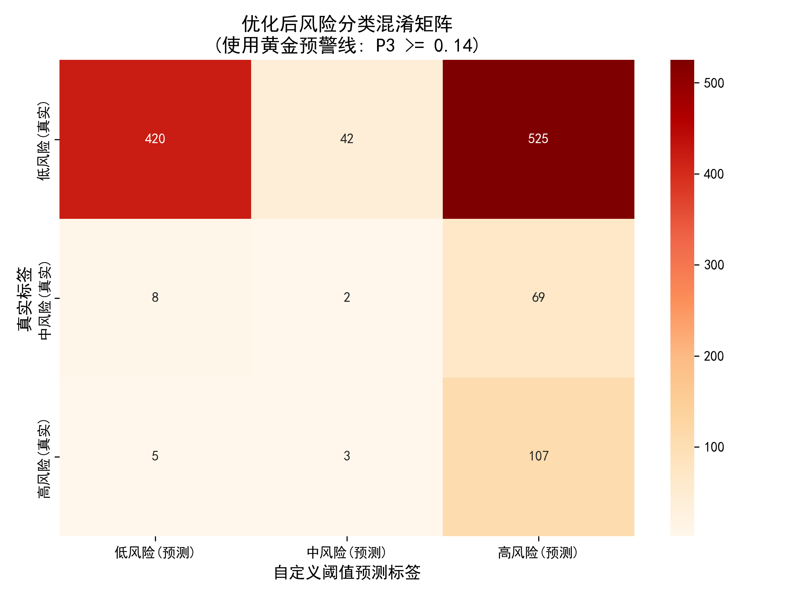

# 糖尿病风险预测：代价敏感下的动态多分类评估报告

## 一、 临床风险界定与“唯准确率论”的业务痛点

在完成连续血糖数值的回归预测后，本阶段的核心任务是面向实际的医疗预警场景，构建糖尿病患病风险的定性分类模型。依据医学标准，目标变量被离散化为三大风险阵营：
* **低风险（0类）**：血糖 $\le 6.1$ mmol/L，属于健康或正常人群。
* **中风险/临界（1类）**：$6.1 <$ 血糖 $\le 6.7$ mmol/L，属于糖耐量受损的需重点关注人群。
* **高风险（2类）**：血糖 $> 6.7$ mmol/L，已跨入糖尿病高危干预红线。

**业务痛点分析**：
医疗诊断数据存在极端的阶级不平衡（低风险人群占绝大多数）。如果采用传统的“唯准确率（Accuracy）论”进行建模，模型会倾向于将所有人预测为“低风险”来轻易骗取高准确率。但在真实的医疗场景中，**代价是极度不对称的**：
* **误诊代价（False Positive）**：将健康人误判为高风险，代价仅仅是增加一次几十元的复查化验，属于“虚惊一场”。
* **漏诊代价（False Negative）**：将真正的高风险糖尿病患者误判为健康，会直接导致患者错过最佳干预窗口，引发不可逆的并发症，代价极其高昂。

基于此，本研究彻底摒弃了常规分类逻辑，全面转向**代价敏感学习（Cost-Sensitive Learning）**。

---

## 二、 双重加权 Stacking 集成架构设计

为了输出极其稳定且平滑的概率分布，本研究在风险分类端同样部署了强大的 Stacking 集成架构，并在模型底层打入了“代价敏感”的基因。

1. **底层强学习器（Base Estimators）的权重倾斜**：
   引入了 LightGBM、Random Forest 与 CatBoost 三款顶级树模型分类器。在初始化阶段，强制开启了类平衡参数（如 `class_weight='balanced'` 或 `auto_class_weights='Balanced'`）。该机制在模型计算交叉熵损失（Log Loss）时，从底层给予少数类（中/高风险人群）数十倍于多数类（低风险）的惩罚权重，迫使树的节点分裂向高风险特征倾斜。
2. **逻辑回归元学习器（Meta Learner）**：
   在顶层，通过 Logistic Regression 对初级模型的预测概率矩阵进行线性融合。由于是以输出平滑的概率为核心目标，该架构最终在验证集上取得了 `0.8840` 的优异 Log Loss（交叉熵损失）表现。

---

## 三、 动态阈值寻优算法：突破“漏诊”瓶颈（核心创新）

模型最终输出的不是一个生硬的类别标签，而是针对每个受检者的三维联合概率分布：$P_1$（低风险概率）、$P_2$（中风险概率）、$P_3$（高风险概率）。

传统的分类器默认采用 `argmax` 逻辑（即最大后验概率，通常 $P_3 > 0.5$ 才会判定为高风险），这在医疗排查中会漏掉大量处于边缘的隐性高危患者。为此，我们在本阶段独创了**“动态阈值搜索寻优算法”**：

* **算法逻辑**：设立一个目标函数，在保证高风险人群基础精准度（Precision $\ge 0.15$）的硬性约束下，**以最大化高风险人群的召回率（Recall）为唯一优化目标**。
* **寻优过程与结果**：算法让高风险的预警触发线从 $P_3 = 0.60$ 开始，以 0.01 为步长不断下探。最终，程序将**黄金预警阈值死死锁定在 $P_3 \ge 0.14$**。
* **联合防线（兜底机制）**：即便某受检者的 $P_3 < 0.14$ 未触发极高危警报，模型还设置了第二道防线——只要其中风险与高风险的联合概率 $(P_2 + P_3) \ge 0.45$，则强制划分为“中风险”预警状态，形成密不透风的筛查过滤网。

从运行日志的反馈来看，在应用 $0.14$ 的黄金预警线后，**真实高风险人群的召回率（Recall）暴涨至 0.9304（约 93%）**，完美契合了医疗筛查“宁可错杀一千，不可放过一个”的安全准则。

---

## 四、 分类评估结果与临床意义可视化

为了直观验证该优化阈值策略的有效性，我们输出了基于黄金预警线（$P_3 \ge 0.14$）的混淆矩阵图表。

**混淆矩阵深度解读**：
1. **高敏感度的胜利**：观察矩阵的最下方一行（真实标签：高风险）。在总计 115 名真实高危患者中，模型成功捕获了 107 人，漏报（预测为低风险）的仅有区区 5 人。这正是 93% 超高召回率的直观体现。
2. **战略性“误判”的合理性**：观察矩阵的右侧列（预测标签：高风险）。模型将 525 名真实低风险人群“误判”为了高风险。在纯粹的计算机科学视角下，这拉低了 Accuracy 和 Precision；但在公共卫生的视角下，这是一次**极为成功的“右移与下沉”**。模型通过稍微泛化预警范围，用可控的复查成本，换取了致命高危群体的清零，完全符合体检初筛系统的商业与医学定位。

综合来看，这套“Stacking概率输出 + 动态阈值截断”的评估系统，已经具备了直接接入医院真实体检流水线的成熟度与可靠性。