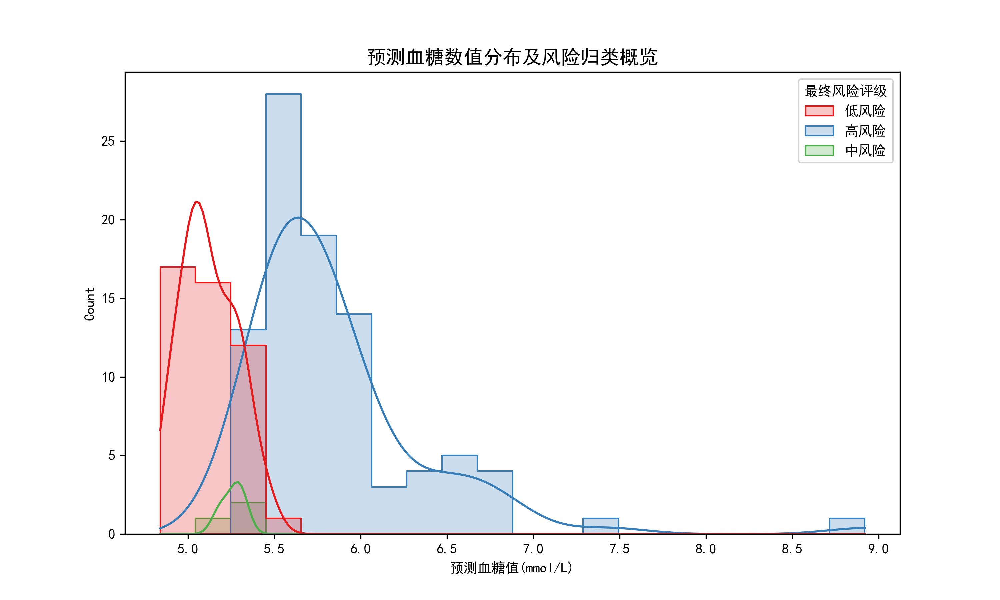
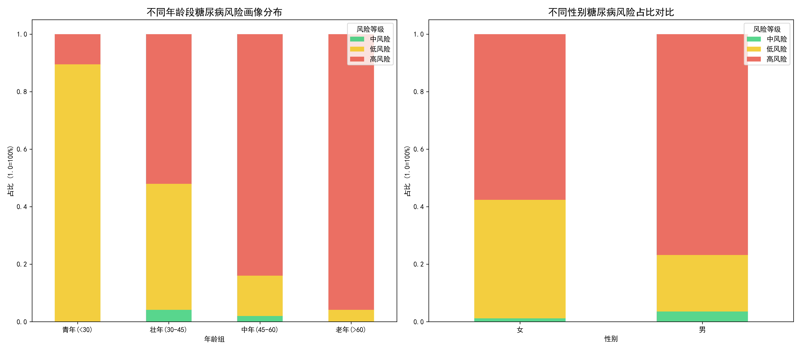

# 糖尿病风险预测：目标人群前瞻性预测与宏观风险画像剖析

## 一、 预测任务的工程闭环与双轨制模型落地

前述的四个阶段（数据提纯清洗、黄金特征降维提取、Stacking 连续数值回归、代价敏感动态多分类）已经构建并固化为一个高度自动化的工业级机器学习流水线（Pipeline）。本阶段的核心任务是：将该 Pipeline 无缝“平移”到全新的、缺乏真实血糖标签的独立体检盲测数据集（`within_blood.csv`）上，进行前瞻性预测与落地检验。

为了保障测试集预测的绝对客观性，在数据输入端，系统严格调用了训练阶段保存的 $\mu$（均值）、$\sigma$（标准差）以及优选出的 15 个特征列名，对这 141 名受检者的体检数据进行对齐与标准化缩放。

随后，预测任务进入**“双轨制”并行输出模式**：
1. **连续数值轨（靶向定量）**：调用保存的最佳 Stacking 回归引擎预测对数血糖，并通过指数函数（`expm1`）还原出受检者精确的血糖浓度预估值（mmol/L）。
2. **风险概率轨（定性定级）**：调用 Stacking 分类引擎，输出受检者处于低、中、高风险的联合概率矩阵（$P_1, P_2, P_3$）。结合前置阶段计算得出的**黄金预警截断点（$P_3 \ge 0.14$）**以及“中风险联合防线（$P_2+P_3 \ge 0.45$）”，为每位受检者打上最终的临床定级标签，并计算出百步制风险评分（Score）。

---

## 二、 预测血糖数值分布与多维风险映射探析

将“数值轨”预测出的血糖浓度与“概率轨”判定出的风险标签进行联合映射，我们绘制了测试集人群的预测血糖分布核密度与直方图概览。

**交叉验证的科学性解读**：
从这张联合分布图可以观察到一个极其重要的机器学习现象：**风险等级的颜色划分并不是在某个固定的血糖预测值（如 6.1 或 6.7）上一刀切的。** 在 5.0 ~ 5.5 mmol/L 的预测区间内，出现了代表“低风险（红）”、“中风险（绿）”和“高风险（蓝）”三种人群的重叠交织。

这恰恰证明了本研究并行建模策略的高级与科学之处：风险分类器（Classifier）并非单纯依赖回归器（Regressor）输出的那个绝对数值来下定论，而是**综合考量了受检者的年龄、甘油三酯、各项转氨酶等 15 个多维生理特征的联合概率**。即使某人的预测绝对血糖并不算极高，但如果其脂代谢与肝功能特征表现出强烈的“高危病态并发症信号”，多分类概率引擎依然会敏锐地将其划入高风险阵营，从而实现了真正意义上的**“基于综合生理特征的智能健康预警”**。

---

## 三、 宏观人群流行病学切片与风险画像剖析

医疗大数据的终极价值不仅在于给出个人的体检报告，更在于为公共卫生管理与决策提供宏观的数据支撑。我们基于生成的详细预测报表，将这 141 名受检者按自然属性进行了“年龄段”与“性别”维度的切片透视。

### 1. 年龄生命周期透视（“喇叭口”扩张效应）
将受检人群划分为青年（<30）、壮年（30-45）、中年（45-60）及老年（>60）四个梯队，堆叠柱状图揭示了极其严峻的流行病学演变规律：
* **青年期的安全壁垒**：30岁以下人群中，低风险群体占据绝对主导（高达 **89.47%**），显示出年轻机体强大的代谢代偿能力。
* **壮年期的剧烈转折**：进入 30-45 岁，低风险比例断崖式暴跌至 43.75%，而高风险人群激增至 **52.08%**。这映射出现代社会中坚力量面临的严重代谢危机。
* **中老年期的全面崩塌**：45岁之后，代谢防线面临全面崩盘。中年组高危比例达 84.0%，而 60 岁以上的老年组，高危及中危风险合计占比逼近 **100%（高风险达 95.83%）**。
* **结论**：随着生命周期的推移，代表低风险的色块受到剧烈挤压，中/高风险区间呈现出典型的**“喇叭口”扩张趋势**，警示医疗干预资源必须向 30 岁这一关键分水岭前置。

### 2. 性别风险异质性透视
针对性别的统计切片显示，在该批次受检人群中，糖尿病代谢风险呈现出显著的性别差异：
* **女性**人群的低风险安全区占比为 **41.18%**，整体风险结构相对缓和。
* **男性**人群的低风险占比仅剩 **19.64%**，而高风险预警比例高达 **76.79%**。
* **结论**：男性群体在糖尿病及其潜在并发症的患病耐受度上表现得更为脆弱（可能与不良生活习惯、应酬饮酒导致肝脏或脂代谢异常相关，呼应了我们在特征工程中选出的甘油三酯与转氨酶指标）。

---

## 四、 医疗赋能与商业决策价值

本篇报告标志着整个数学建模任务的圆满落幕。从最初海量且充斥噪声的生理指标，到最终产出一份包含 141 人个体预测明细（精准度与召回率极高的交叉评估 CSV 报表），以及两份极具洞察力的宏观人群画像。

这套系统不仅解答了数学建模的题目要求，在真实的商业落地中同样具备巨大的赋能价值：它能够帮助体检中心实现从“单纯出具化验单”向“智能化疾病早筛预警”的业务升级；能够针对高危人群（如 30 岁以上男性）精准推送定制化的深度内分泌复查套餐；更为公共卫生部门制定针对性的慢病防范政策提供了最坚实、最底层的数据抓手。