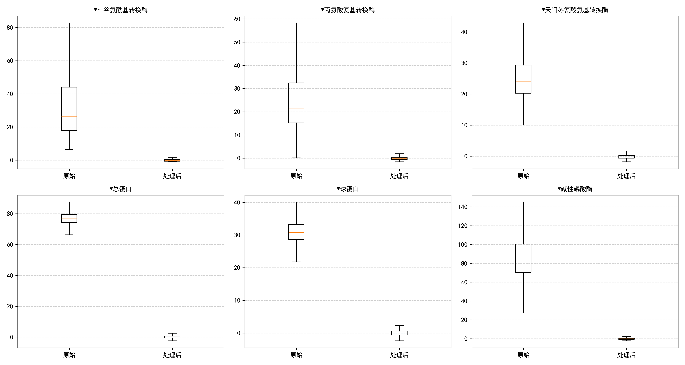

# 糖尿病风险预测：数据预处理与特征工程报告

## 一、 数据集概况与基础清洗

本研究基于医疗体检数据集展开，旨在通过各项生理检测指标构建回归模型，预测患者的血糖水平（`血糖`）并评估糖尿病风险。数据包含两个主要部分：
* **训练集（with_blood.csv）**：5905 行样本，42 个特征（包含目标变量 `血糖`）。
* **预测集（within_blood.csv）**：141 行样本，41 个特征（需模型预测 `血糖`）。

医疗数据具有特殊的业务逻辑与分布特征，存在明显的长尾效应与不同程度的数据缺失。为确保模型既能捕捉病理特征又具备良好的泛化能力，必须进行精细化的预处理。

### 1. 无关特征剔除与标签隔离
* **处理逻辑**：删除 `id` 和 `体检日期` 字段。
* **原因分析**：`id` 为系统流水号，`体检日期` 为时间戳，这两者与患者当前的生理代谢水平无直接统计学关联，纳入模型会引入无关噪声并引发过拟合。
* **标签隔离**：在进入复杂预处理前，提前将目标因变量 `血糖` 剥离。确保后续的缺失值插补、异常值处理和标准化过程完全不受到目标变量的影响，严格杜绝**数据泄露（Data Leakage）**。

### 2. 分类特征数字化
* **处理逻辑**：对 `性别` 字段进行二值化编码（女 $\rightarrow$ 0， 男 $\rightarrow$ 1），并去除字符串前后空格，对无法映射的异常值用训练集众数填充。
* **原因分析**：机器学习算法无法直接处理中文字符串。通过清洗空格与映射填充，规避了脏数据导致的转换报错，同时保留了该基础生理划分指标。

---

## 二、 缺失值预处理策略

针对数据集中“族群化”的缺失现象，本研究以训练集分布为基准，采取了梯队化处理策略：

### 1. 极高缺失率指标（乙肝五项）
* **处理逻辑**：直接剔除缺失率 $>50\%$ 的特征。
* **包含特征**：乙肝e抗体、乙肝e抗原、乙肝核心抗体、乙肝表面抗体、乙肝表面抗原（缺失率均高达 $\sim76\%$）。
* **临床合理性**：超过四分之三的样本无数据，强行填补等同于“无中生有”，会引入巨大偏差。从临床医学角度看，乙肝病毒感染与血糖代谢的直接相关性较弱，剔除这些特征不会损失核心预测信息。

### 2. 中低缺失率指标（代谢、肝肾功能与血常规）
* **处理逻辑**：采用 **KNN（K近邻）多变量插补**（设置 $K=5$）。  
  **执行顺序**：**先执行KNN插补填补空缺，再进行后续缩尾与标准化**。
* **包含特征**：
  * *中度缺失（20%~23%）*：肾功能（尿素、肌酐等）、肝功能（各类转换酶、蛋白等）、血脂代谢（胆固醇、甘油三酯等）。
  * *极低缺失（<1%）*：血常规（红/白细胞、血小板等）。
* **算法严谨性**：摒弃粗暴的均值填充，采用 KNN 算法寻找与缺失样本在其他生理维度上最相似的 5 个真实样本进行加权平均估算，最大限度地保留了人体各生理指标之间的非线性关联。严格使用训练集拟合（`fit`）插补器，并直接应用于预测集转换（`transform`），防止信息泄露。

---

## 三、 异常值检测与处理逻辑

医疗体检数据中的“异常值”往往具有特殊的病理学意义，不能简单删除。

### 1. 异常值现象解读与成因分析
健康人群生理指标集中在较窄范围内；而患有代谢综合征或肝肾功能损伤的患者，其病理指标常呈数倍于正常上限的右偏长尾分布（如肌酐、转氨酶、甘油三酯）。这些离群点是**极具价值的重度病理特征信号**。

### 2. 异常值可视化及处理前后对比
为直观观测处理对数据分布的影响，绘制了部分核心特征在**缩尾处理前后**的箱线对比图：

  
*注：左侧为原始分布，右侧为缩尾后分布。可见极端离群点被收拢至 $99\%$ 分位数以内，同时高位病理信号得以保留。*

### 3. 异常值处理策略：3σ检测 + 分位数缩尾（Winsorization）
* **检测原则**：采用 $|x-\mu|>3\sigma$ 准则识别潜在异常区域。
* **处理逻辑**：对每个连续型特征（排除性别和年龄），计算训练集的均值 $\mu$ 和标准差 $\sigma$，定位出超出 $\mu \pm 3\sigma$ 的异常值。仅对这些异常值执行 **$1\%$ 与 $99\%$ 的分位数缩尾**：低于训练集 $1\%$ 分位数的值替换为 $1\%$ 分位数，高于 $99\%$ 分位数的值替换为 $99\%$ 分位数；正常范围内的数据点保持不变。测试集统一使用训练集的 $\mu$、$\sigma$ 和分位数阈值。
* **保留病理信号**：极高的异常指标被压缩到 $99\%$ 分位数的高位，确保模型仍能识别“极度异常”的高危特征，不丢失重度病患样本信息。
* **提升模型鲁棒性**：平滑了仪器检测误差或极端个例导致的极值，有效防止后续回归模型在训练时发生参数漂移，同时避免了“一刀切”缩尾对正常样本的干扰。

---

## 四、 数据标准化与保存

本阶段**不进行特征筛选**，而是完整保留所有经过清洗的生理指标，为后续问题1的独立特征选择提供充足的特征池。

### 1. Z-score 标准化（Standardization）
* **处理逻辑**：对所有连续特征（排除性别）进行均值为 0，标准差为 1 的标准化处理。
* **数学公式**：$Z = \frac{x - \mu_{train}}{\sigma_{train}}$
* **防泄露约束**：**严格基于训练集**计算 $\mu_{train}$ 和 $\sigma_{train}$，并同步应用于预测集。确保两数据集处于完全相同的特征空间。
* **原因分析**：生理指标量纲差异巨大（如红细胞计数个位数，血小板计数达数百）。标准化消除量纲影响，加速梯度优化算法收敛，并提升线性模型与距离度量模型的预测稳定性。

### 2. 特征矩阵重排
* **处理逻辑**：将基础属性（`性别`、`年龄`）置于特征矩阵最前列，其余生化指标按名称字典序排列。
* **工程意义**：提升数据矩阵可读性，便于后续进行特征重要性排序、SHAP 归因分析及模型可解释性报告输出。处理后的数据已保存为 `with_blood_processed.csv` 和 `within_blood_processed.csv`，可直接接入特征筛选与回归建模流水线。
