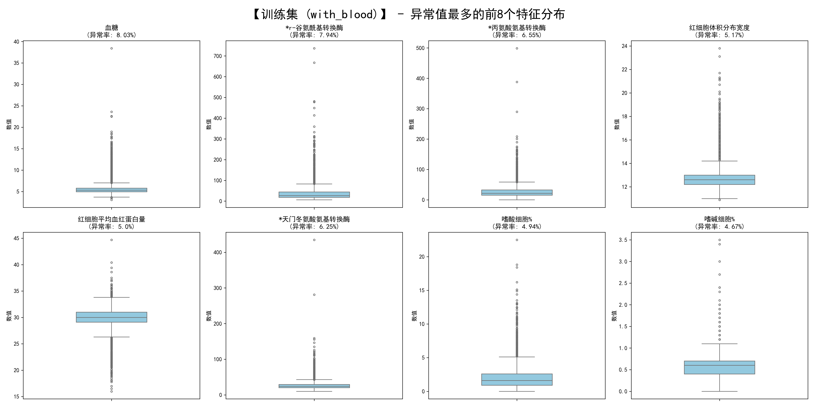
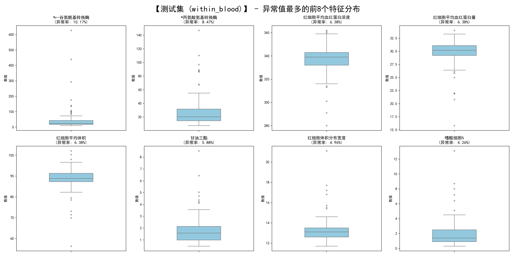

# 糖尿病风险预测：数据预处理与特征工程报告

## 一、 数据集概况

本研究基于医疗体检数据集展开，旨在通过各项生理检测指标预测患者的血糖水平及评估糖尿病风险。数据包含两个主要部分：训练集（with_blood.csv）与测试集（within_blood.csv）。

原始数据共包含 42 个特征指标，涵盖了患者的自然信息（如年龄、性别）、肝功能、肾功能、血脂代谢指标、血常规数据以及乙肝五项等。医疗数据具有特殊的业务逻辑与分布特征，存在明显的长尾效应（右偏态分布）与不同程度的数据缺失。因此，在构建预测模型前，必须结合临床医学常识与统计学规律，对数据进行精细化的预处理，以确保模型既能捕捉病理特征，又不会被无关噪声干扰。

---

## 二、 缺失值预处理策略

针对不同维度的特征缺失情况，本研究将特征划分为三个梯队，并采取了针对性的处理逻辑：

### 1. 极高缺失率指标（乙肝五项）
* **处理逻辑**：直接剔除（Drop Columns）
* **包含特征**：乙肝e抗体、乙肝e抗原、乙肝核心抗体、乙肝表面抗体、乙肝表面抗原。
* **数据与临床合理性**：上述指标缺失比例高达 76% 以上，意味着超过四分之三的样本无数据。强行使用算法填补等同于“无中生有”，会给模型引入巨大噪声。从临床医学常识来看，乙肝病毒感染与糖尿病等代谢性疾病的直接相关性较弱，剔除这些特征不会损失预测血糖的核心信息。

### 2. 中度缺失率指标（代谢与肝肾功能）
* **处理逻辑**：KNN（K近邻）多变量高级插补
* **包含特征**：肾功能（尿素、尿酸、肌酐）、肝功能（各类转换酶、总蛋白、球蛋白、白蛋白、白球比例等）、血脂代谢（高/低密度脂蛋白胆固醇、总胆固醇、甘油三酯）。
* **数据与临床合理性**：该类指标缺失率在 15% 至 23.5% 之间，但包含了与血糖水平和糖尿病风险高度绑定的核心代谢指标，绝对不能删除。为避免破坏数据的真实分布，摒弃了粗暴的均值填充，采用 KNN 插补算法寻找各项指标最接近的多个样本进行加权平均估算，从而最大限度保留了生理学上的关联性。

### 3. 极低缺失率指标（血常规）
* **处理逻辑**：并入 KNN 统一插补（全局一致性）
* **包含特征**：血小板相关指标、白细胞与免疫细胞大类、红细胞与供氧指标。
* **数据与临床合理性**：此类特征缺失率极低（小于 0.5%）。为保证特征矩阵的全局一致性且不损失任何一个宝贵的训练样本，将其与第二类指标一同送入 KNN 插补器中进行统一处理。此举不仅插补准确度极高，同时也省去了分段处理可能带来的数据泄露风险。

---

## 三、 异常值检测与处理逻辑

医疗体检数据中的“异常值”往往具有特殊的病理学意义，处理策略直接影响模型的泛化能力。

### 1. 异常值现象解读与成因分析
* 基于 IQR（四分位距）检测结果显示，多数生理指标存在一定比例的统计学异常值，并在箱线图上呈现明显的“长尾分布”特征。
* 这种现象完全符合临床客观规律。对于健康人群，指标集中在较窄的范围内波动；而对于患有代谢综合征或肝肾功能损伤的患者，其病理指标往往会数倍于正常上限。这些离群点实际上是极具价值的重度病理特征信号。

### 2. 核心异常特征聚焦
* **目标变量（血糖）**：异常值占比约 8.03%，最高值达 38.43 mmol/L，直接反映了数据集中包含了相当数量的重度糖尿病患者。
* **肝功能与脂代谢指标**：如 r-谷氨酰基转换酶、丙氨酸氨基转换酶、甘油三酯等。这些高频异常指标说明目标人群中可能存在较高的脂肪肝或相关代谢并发症比例，是后续建模的强相关特征。

### 3. 异常值可视化
**（1）训练集异常分布：**

*注：训练集中血糖异常占比约 8.03%，反映了数据集中包含相当数量的重度糖尿病患者。*

**（2）测试集异常分布：**

*注：测试集特征分布与训练集高度一致，确保了模型迁移的有效性。*

### 4. 异常值处理策略（分位数截断法 / Winsorization）
* **处理逻辑**：摒弃 IQR 剔除法，采用 1% 与 99% 的分位数截断法（盖帽法）。将低于 1% 分位数和高于 99% 分位数的值，强制替换为对应的边界临界值。
* **保留病理信号**：极高的指标依然维持在 99% 分位数的高位，确保模型依然能有效识别出该样本的“偏高”危险特征，不丢失高危样本信息。
* **提升模型鲁棒性**：消除了由于仪器误差或极端个例导致的数千倍极值，有效防止后续回归模型（尤其是线性敏感模型）在训练时发生梯度爆炸或拟合偏移。