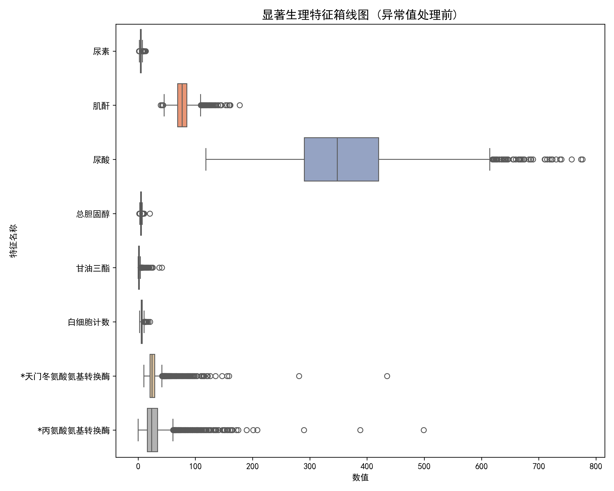

# 糖尿病风险预测：数据预处理与特征工程报告

## 一、 数据集概况与基础清洗

本研究基于医疗体检数据集展开，旨在通过各项生理检测指标构建回归模型，预测患者的血糖水平（`血糖`）并评估糖尿病风险。数据包含两个主要部分：
* **训练集（with_blood.csv）**：5905 行样本，42 个特征（包含目标变量 `血糖`）。
* **预测集（within_blood.csv）**：141 行样本，41 个特征（需模型预测 `血糖`）。

医疗数据具有特殊的业务逻辑与分布特征，存在明显的长尾效应与不同程度的数据缺失。为确保模型既能捕捉病理特征又具备良好的泛化能力，必须进行精细化的预处理。

### 1. 无关特征剔除与标签隔离
* **处理逻辑**：删除 `id` 和 `体检日期` 字段。
* **原因分析**：ID 为系统流水号，体检日期为时间戳，这两者与患者当前的生理代谢水平无直接统计学关联，纳入模型会引入无关噪声并引发过拟合。
* **标签隔离**：在进入复杂预处理前，提前将目标因变量 `血糖` 剥离。确保后续的缺失值插补、异常值处理和标准化过程完全不受到目标变量的影响，严格杜绝**数据泄露（Data Leakage）**。

### 2. 分类特征数字化
* **处理逻辑**：对 `性别` 字段进行二值化编码（女 $\rightarrow$ 0， 男 $\rightarrow$ 1）。
* **原因分析**：机器学习算法通常无法直接计算中文字符串。同时通过去除字符串前后的空格，规避了由于脏数据（如 `'男 '`）导致的转换报错。

---

## 二、 缺失值预处理策略

针对两个数据集中高度一致的“族群化”缺失现象，本研究以训练集的分布为基准，采取了梯队化的处理策略：

### 1. 极高缺失率指标（乙肝五项）
* **处理逻辑**：直接剔除缺失率 $>50\%$ 的特征。
* **包含特征**：乙肝e抗体、乙肝e抗原、乙肝核心抗体、乙肝表面抗体、乙肝表面抗原（缺失率均高达 $\sim76\%$）。
* **数据与临床合理性**：超过四分之三的样本无数据，强行使用算法填补等同于“无中生有”，会给模型引入巨大误差。从临床医学常识来看，乙肝病毒感染与糖尿病等代谢性疾病的直接相关性较弱，剔除这些特征不会损失预测血糖的核心信息。

### 2. 中低缺失率指标（代谢、肝肾功能与血常规）
* **处理逻辑**：采用 **KNN（K近邻）多变量高级插补**（设置 $K=5$）。
* **包含特征**：
  * *中度缺失（20%~23%）*：肾功能（尿素、肌酐等）、肝功能（各类转换酶、蛋白等）、血脂代谢（胆固醇、甘油三酯等）。
  * *极低缺失（<1%）*：血常规（红/白细胞、血小板等）。
* **数据与临床合理性**：肝肾功能与血脂是与血糖水平高度绑定的核心代谢指标，绝对不能删除。摒弃粗暴的均值填充，采用 KNN 算法寻找与缺失样本在其他生理维度上最相似的 5 个真实样本进行加权平均估算，最大限度地保留了人体各生理指标之间的非线性关联。
* **模型严谨性**：严格使用训练集数据拟合（fit）KNN 插补器，并直接应用于预测集的转换（transform），防止未来数据的信息泄露到训练阶段。

---

## 三、 异常值检测与处理逻辑

医疗体检数据中的“异常值”往往具有特殊的病理学意义，不能简单粗暴地删除。

### 1. 异常值现象解读与成因分析
对于健康人群，生理指标集中在较窄的范围内波动；而对于患有代谢综合征或肝肾功能损伤的患者，其病理指标往往会数倍于正常上限。在我们的数据中，如肌酐、转氨酶、甘油三酯等均呈现明显的右偏长尾分布。这些离群点实际上是**极具价值的重度病理特征信号**。

### 2. 异常值可视化
为了直观观测数据的分布状况，本研究筛选了尿素、肌酐、总胆固醇、转氨酶等显著且具有代表性的连续型生理特征，绘制了水平箱线图：

*注：大量游离于胡须之外的“黑点”即为潜在的重度生理异常指标，直接反映了人群中的高危/患病个体。*

### 3. 异常值处理策略：分位数缩尾（Winsorization）
* **处理逻辑**：摒弃传统的 $|x-\mu|>3\sigma$ 删除法，采用 **$1\%$ 与 $99\%$ 的分位数缩尾（盖帽法）**。针对连续型生理特征（排除性别和年龄），将低于训练集 $1\%$ 分位数和高于 $99\%$ 分位数的值，强制替换为对应的边界临界值。
* **保留病理信号**：极高的指标依然维持在 $99\%$ 分位数的高位，确保模型依然能有效识别出该样本的“极度异常”高危特征，不会丢失重度病患样本的信息。
* **提升模型鲁棒性**：消除了由于仪器检测误差或极端个例导致的异常极值，有效防止后续回归模型（尤其是基于距离度量的模型）在训练时发生梯度爆炸或被极端值拉偏回归面。

---

## 四、 特征标准化与特征重排

### 1. Z-score 标准化（Standardization）
* **处理逻辑**：对除 `性别` 外的所有连续特征（包含年龄）进行均值为 0，标准差为 1 的标准化处理。
* **数学公式**：$Z = \frac{x - \mu_{train}}{\sigma_{train}}$
* **重要约束**：**严格遵守机器学习范式**，利用训练集计算出的均值（$\mu_{train}$）和标准差（$\sigma_{train}$）来标准化训练集和预测集（within_blood）。这保证了预测集数据处于同一个缩放空间中。
* **原因分析**：各生理指标的量纲和数量级差异巨大（例如红细胞计数可能在个位数，而血小板计数则高达数百）。标准化可消除量纲影响，加速梯度下降等优化算法的收敛速度，并提升树模型以外算法的预测精度。

### 2. 特征重新排列
* **处理逻辑**：将基础属性（`性别`、`年龄`）置于数据表的最前方，剩余的所有生理生化检验特征按照名称字符顺序重新排序。
* **原因分析**：提升了数据矩阵的可读性与规范性，便于后期进行特征重要性（Feature Importance）分析以及模型解释（如 SHAP 值分析）时的对照与复核。处理后的数据最终分别保存为可供建模直接读取的清洗后文件。