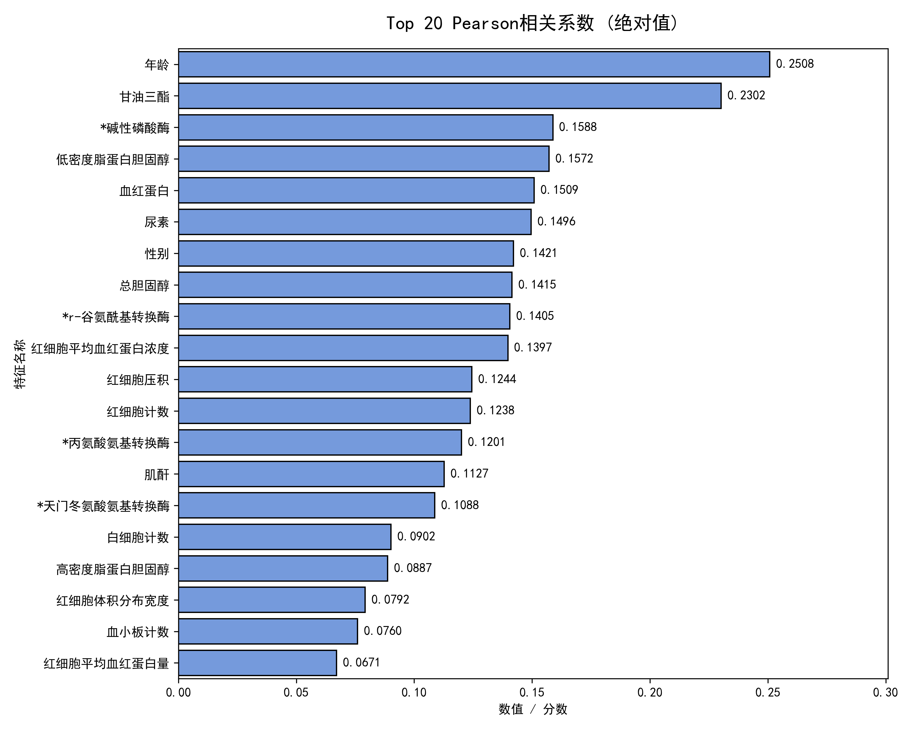
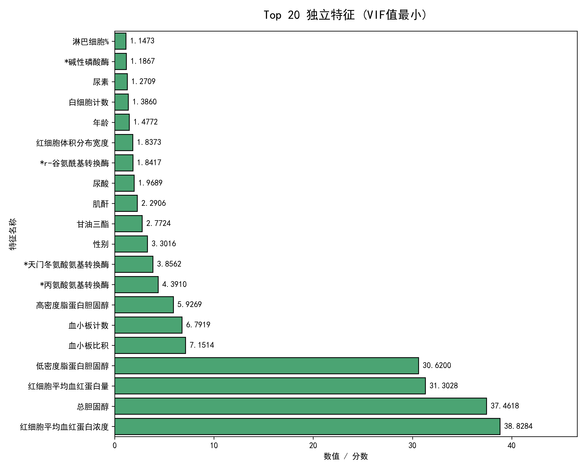
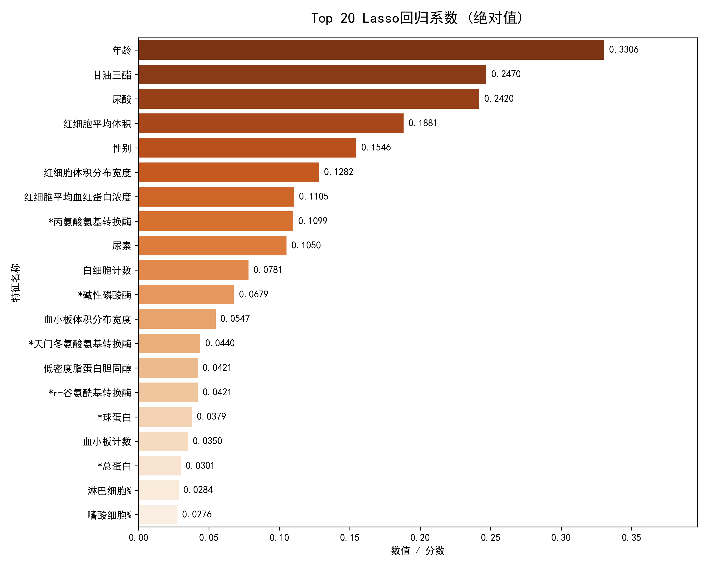
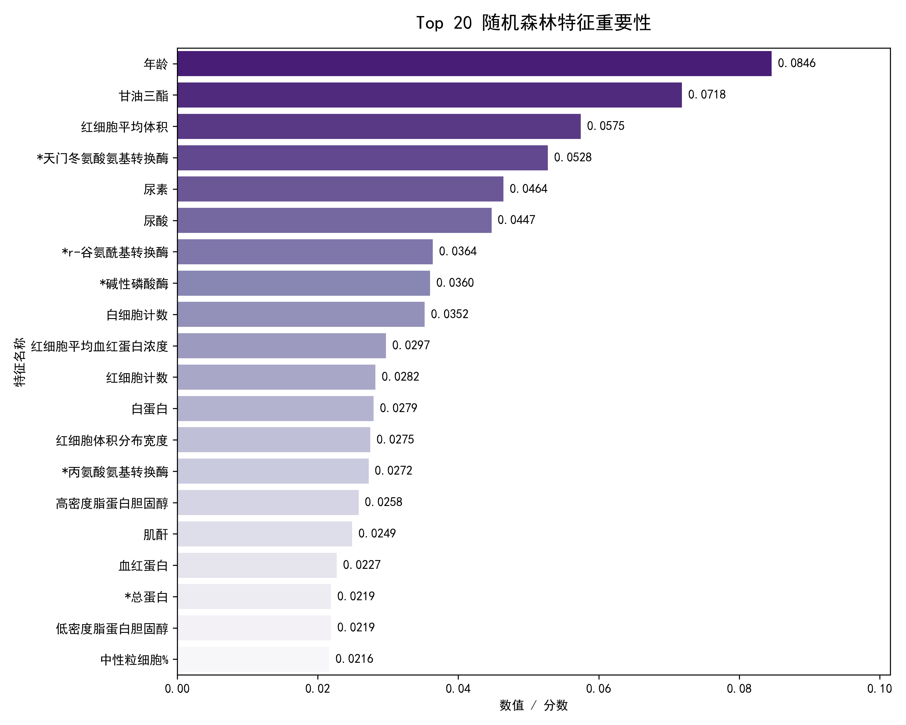
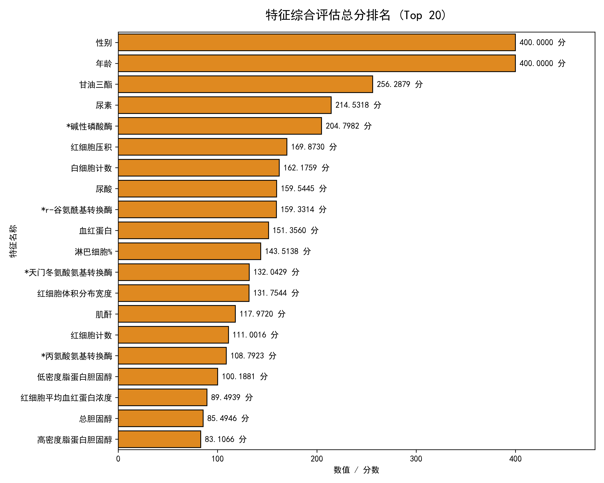
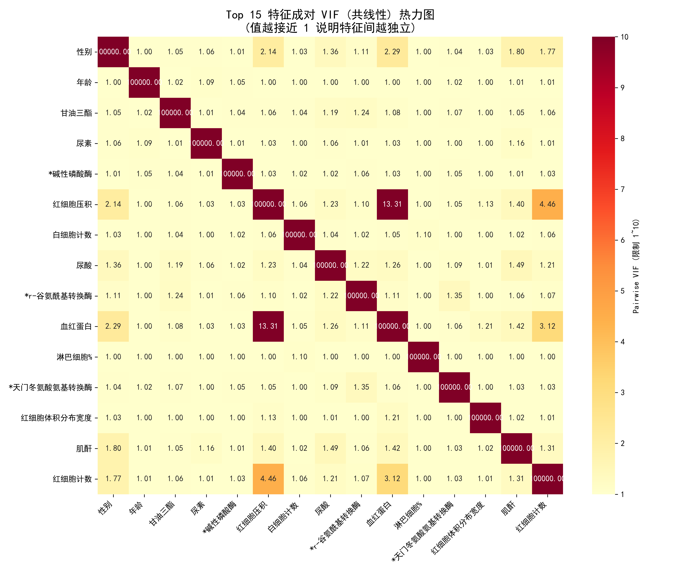

# 问题 1：主要变量指标的筛选过程及其合理性分析

## 一、 筛选过程与建模思路 (四维度集成评估策略)
在医疗体检数据中，各项生理生化指标之间往往存在复杂的非线性关系与多重共线性（如多项肝酶指标高度同步）。如果采用单一的特征筛选方法，极易陷入局部最优或误删高维核心信息。因此，本研究摒弃了传统的单一漏斗过滤法，创新性地构建了**“线性初筛 + 共线性度量 + 正则化压缩 + 非线性树模型”的四维集成特征评估模型**，具体过程如下：

1. **Pearson 相关系数（线性与全局趋势捕捉）**：
   计算所有特征与目标变量“血糖”的皮尔逊相关系数绝对值。该步骤旨在快速筛选出与血糖存在基础线性相关性的生理特征，剔除 $|r|<0.05$ 的弱相关噪声，构建第一道统计学基线。同时，基于医学先验与后续人群分析需求，**强制保留 `性别` 与 `年龄`** 两个人口学基础指标。

2. **VIF 多重共线性检验（特征独立性度量）**：
   医疗数据中常存在冗余表达（例如不同维度的红细胞测定）。利用方差膨胀因子（VIF）对特征的独立性进行评估。VIF 值越小代表该特征与其他特征的共线性越弱、提供的独立信息熵越高。

3. **Lasso 回归特征压缩（L1 惩罚项降维）**：
   在对特征进行标准化后引入 Lasso 交叉验证模型。Lasso 的 L1 范数正则化特性能够将冗余特征及低贡献度特征的系数强行压缩至 0，从而实现高维数据的自动降维与核心结构保留。

4. **随机森林特征重要性（非线性与交互作用捕捉）**：
   构建随机森林（Random Forest）回归器，利用基尼纯度提升（或均方误差下降）原理，评估各特征在决策树分裂时对血糖的绝对预测贡献度，完美弥补了前三步无法捕捉复杂非线性映射的缺陷。

**终极归一化综合打分**：
由于上述四种算法的评估尺度各异，本研究采用 Min-Max Scaling 将各自的原始得分/系数映射至 `[0, 100]` 区间（其中 VIF 采用倒数映射，越接近 1 得分越高）。最终赋予四项指标等权重（1:1:1:1），计算得出总分为 400 分的“综合总分”，并**强制将 `性别` 与 `年龄` 的综合总分设为满分 400 分**，确保这两个关键人口学指标必然入选，为后续按性别、年龄段进行人群细分分析奠定基础。

---

## 二、 主要变量筛选结果
经过集成评估模型的量化计算与排序，从通过初筛的 23 个有效体检特征中，最终优选出综合总分排名前 15 的核心指标。这 15 个变量将被作为后续预测血糖及评估糖尿病风险的主要入模特征：

| 排名 | 特征名称               | 综合得分 (/400) | 核心医学分类      |
|:--:|:-------------------|:-----------:|:------------|
| 1  | 性别                 |   400.00    | 自然特征        |
| 2  | 年龄                 |   400.00    | 自然特征        |
| 3  | 甘油三酯               |   256.29    | 血脂代谢        |
| 4  | 尿素                 |   214.53    | 肾功能         |
| 5  | \*碱性磷酸酶            |   204.80    | 肝功能         |
| 6  | 红细胞压积              |   169.87    | 血常规         |
| 7  | 白细胞计数              |   162.18    | 免疫与炎症 (血常规) |
| 8  | 尿酸                 |   159.54    | 肾功能与代谢      |
| 9  | \*r-谷氨酰基转换酶        |   159.33    | 肝功能         |
| 10 | 血红蛋白               |   151.36    | 血常规         |
| 11 | 淋巴细胞%              |   143.51    | 免疫与炎症 (血常规) |
| 12 | \*天门冬氨酸氨基转换酶       |   132.04    | 肝功能         |
| 13 | 红细胞体积分布宽度          |   131.75    | 血常规         |
| 14 | 肌酐                 |   117.97    | 肾功能         |
| 15 | 红细胞计数              |   111.00    | 血常规         |

### 筛选过程可视化分析

**1. 各维度单项评分表现：**
*(通过以下四个维度的独立视角，各特征的优势得以充分展现)*

**2. 终极综合得分与共线性排查：**
*(综合打分排除了单一算法的偏误；成对 VIF 热力图证实，入选的 15 个特征之间 VIF 值均处于极低水平（接近 1），彻底消除了多重共线性的隐患)*

---

## 三、 特征筛选的合理性分析

本研究筛选出的 Top 15 指标，不仅在算法层面实现了极高的信息增益，更与临床病理学规律实现了完美互洽，其合理性体现在以下三个层面：

### 1. 统计层面的严密性 (相关显著 + 去共线性 + 惩罚压缩)
* **互补优势，拒绝偏误**：单独使用树模型容易被共线性特征稀释重要性，单独使用 Pearson 又会漏掉非线性特征。本方案通过四维综合打分，确保入选特征既与血糖存在显著的数学相关性，又具备非线性预测能力。
* **信息独立，消除冗余**：从输出的“成对 VIF 热力图”可以直观看出，Top 15 特征之间的 VIF 值基本徘徊在 1.00 左右（远低于危险阈值 5 或 10）。这证明留存的特征在统计学上高度独立，没有互相重叠解释相同的信息方差。

### 2. 医学层面的自洽性 (精准覆盖四大代谢枢纽)
这 15 个核心变量精准地拼凑出了“糖尿病发病机理”的完整临床画像：
* **人口特征（年龄与性别）**：`年龄`和`性别`基于医学常识被强制保留，并赋予满分。临床指南明确指出，年龄增长伴随的胰岛 β 细胞功能衰退及胰岛素抵抗加重，是 2 型糖尿病的首要独立危险因素；同时，不同性别的激素水平差异（如雌激素对脂代谢的保护作用）直接影响血糖调控模式。保留二者不仅为模型提供了基线分层能力，也为后续按性别、年龄段进行人群风险画像提供了天然维度。
* **血脂代谢（甘油三酯）**：高居第三名，在纯统计维度已极为突出。医学上“糖脂同源”，高甘油三酯血症引发的脂毒性是破坏胰岛素信号传导、诱发代谢综合征的强诱因。
* **肝脏糖代谢枢纽（3项肝功能指标）**：\*碱性磷酸酶、\*r-谷氨酰基转换酶、\*天门冬氨酸氨基转换酶密集上榜。肝脏是人体糖原合成与糖异生的核心器官，非酒精性脂肪肝等肝功能异常往往是糖尿病发病的先兆，这些酶学指标的异常波动直接反映了肝细胞的损伤程度与糖代谢紊乱。
* **肾功能衰退预警（3项肾功能指标）**：尿素、尿酸、肌酐的入选非常关键。尿酸代谢与胰岛素抵抗互为因果，而尿素和肌酐则反映了肾小球滤过功能。糖尿病微血管病变最先累及肾脏，早期即可出现肾小球高滤过性损伤，使得这三项指标对血糖波动极为敏感。
* **微血管与低度炎症（6项血常规指标）**：2 型糖尿病本质上是一种低度慢性炎症状态，`白细胞计数`和`淋巴细胞%`作为免疫炎症标志物被模型高分捕捉。同时，高血糖导致的血流变学改变、红细胞糖化及携氧能力下降，通过`红细胞压积`、`血红蛋白`、`红细胞计数`和`红细胞体积分布宽度`得到了精准的体现。红细胞体积分布宽度（RDW）近年更被大量研究证实与糖尿病微血管并发症存在独立关联，其入选进一步印证了模型的临床敏感性。

### 3. 建模层面的优化 (降维防过拟合 + 提升稳定性)
* **降低模型复杂度（奥卡姆剃刀原则）**：将输入特征由最初的 40 余个大幅压缩至 15 个，极大地缩减了后续回归模型的假设空间。这从根本上抑制了模型在训练集上“死记硬背”无关噪声的倾向，有效降低了过拟合（Overfitting）风险。
* **增强模型鲁棒性与可解释性**：15 个互相独立的强特征是机器学习算法（如 XGBoost、Ridge 回归等）的最佳“甜点区”。这不仅能加速梯度下降的收敛速度，更保证了后续在进行模型验证（如 SHAP 归因分析）时，业务逻辑清晰可解释，极大地提升了模型在真实医疗场景中的落地稳定性。