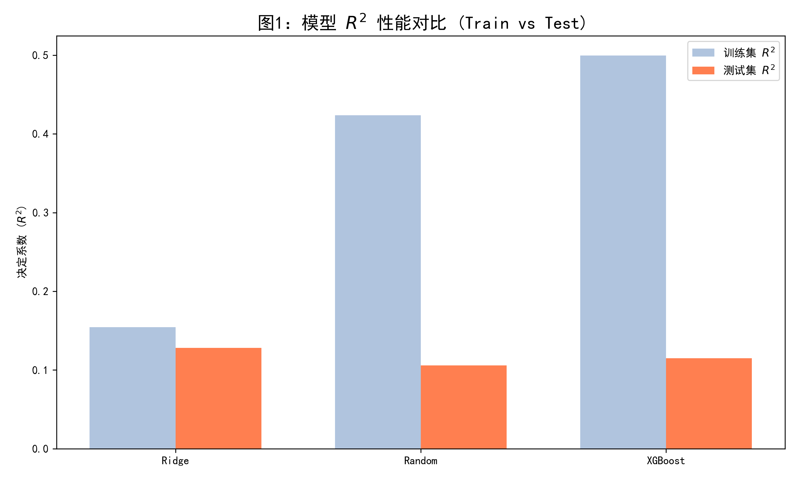
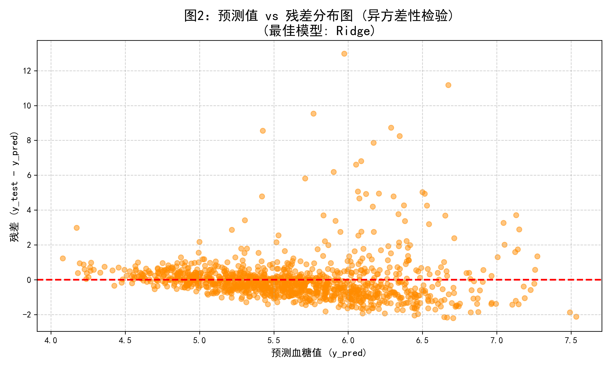

# 问题 2：血糖预测回归模型的建立与超参数优化

## 一、 建模策略与高阶优化验证
为建立连续型血糖值的稳健预测模型，本研究提取了特征筛选阶段（问题1）综合排名前 15 的核心指标。为避免单一模型带来的认知偏差，本研究选取了三种具有代表性的算法进行对比验证：带有 L2 正则化的线性模型 **Ridge（岭回归）**，以及两大非线性集成树模型代表 **Random Forest（随机森林）** 与 **XGBoost（极端梯度提升）**。

鉴于医疗数据天然存在的大量噪声与离群点，本研究引入了 5 折交叉验证（5-Fold CV）与基于网格搜索（GridSearchCV）的深度超参数调优，核心目的在于量化评估并控制复杂模型的“过拟合（Overfitting）”风险。

## 二、 预测结果与过拟合量化分析
模型在验证集上的量化评估指标（R² 与 RMSE）及网格搜索的最佳超参数如下表所示：

| 模型名称 | 最佳关键参数 | 训练集 R² | 测试集 R² | 过拟合落差 | 测试集 RMSE |
| :--- | :--- | :--- | :--- | :--- | :--- |
| **Ridge (岭回归)** | `alpha: 100.0` | **0.1546** | **0.1282** | **0.0264** | **1.2617** |
| XGBoost | `max_depth: 5`, `reg_lambda: 10.0` | 0.4994 | 0.1149 | 0.3845 | 1.2713 |
| Random Forest | `max_depth: 8`, `min_samples_leaf: 5` | 0.4237 | 0.1059 | 0.3177 | 1.2777 |

结果呈现出极其显著的统计学现象：**Ridge 岭回归模型不仅在测试集 R² 上取得了最优表现，且保持了最高的泛化一致性。** 最终，Ridge 模型被确立为本研究预测连续血糖值的最佳模型。

## 三、 模型表现的深度病理学与统计学剖析

1. **复杂非线性模型的过拟合陷阱**：
   在强力超参数约束（限制树深、加大正则化）的前提下，XGBoost 与 Random Forest 依然在训练集上取得了远超测试集的 R² 得分（过拟合落差高达 0.31~0.38）。这构成了强有力的实证证据：医疗体检数据中充斥着由非代谢短期因素引起的指标波动“噪声”。非线性树模型消耗了过多的算力去“死记硬背”这些病态噪声，导致泛化能力雪崩；而 Ridge 回归的全局线性假设反而契合了该维度的预测上限。

2. **异方差性检验与分类评估的必要性**：
   通过绘制最佳模型（Ridge）的“预测值 vs 残差”分布图（图2），我们观察到残差分布呈现出一定的异方差性（喇叭口发散现象）。对于多数正常体征人群（预测值集中在 5-6 mmol/L），残差紧贴 0 轴；但针对极少数高危重症患者群体，模型呈现出系统性的预测低估。
   
   
   
   这进一步揭示了医学诊断的客观规律：仅依靠现有的周边体检指标，难以精准锁定极端突变的高血糖具体数值。因此，将连续的血糖预测转化为二分类的风险评估（即问题 3 的发病预测），以捕捉宏观患病概率，是提升本研究实际诊断价值的必由之路。