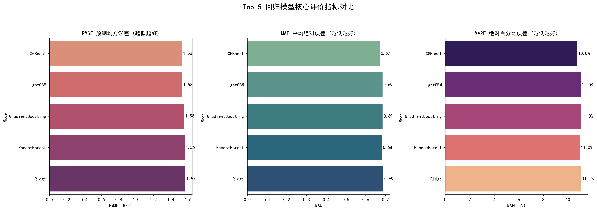
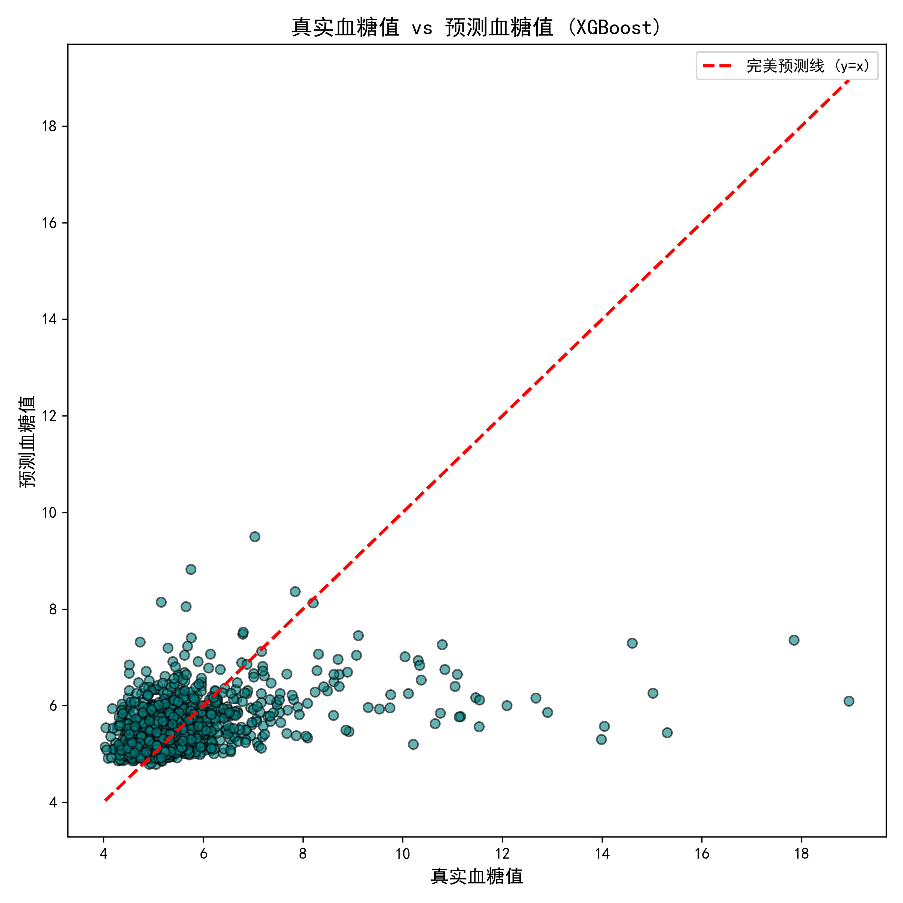
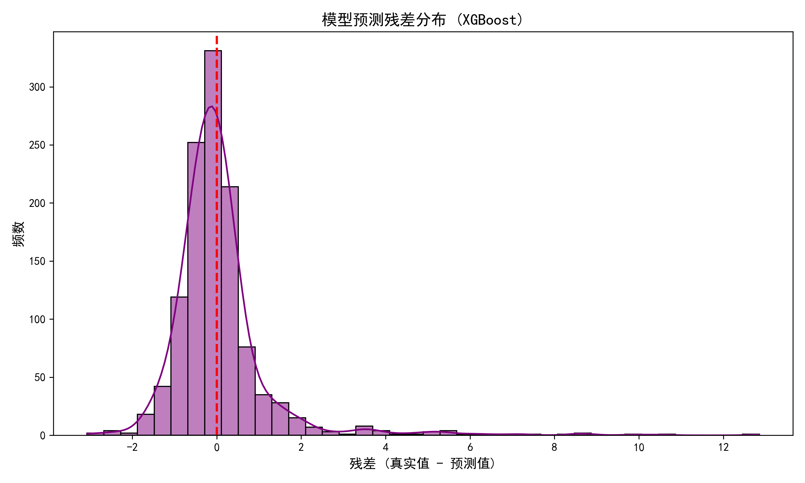
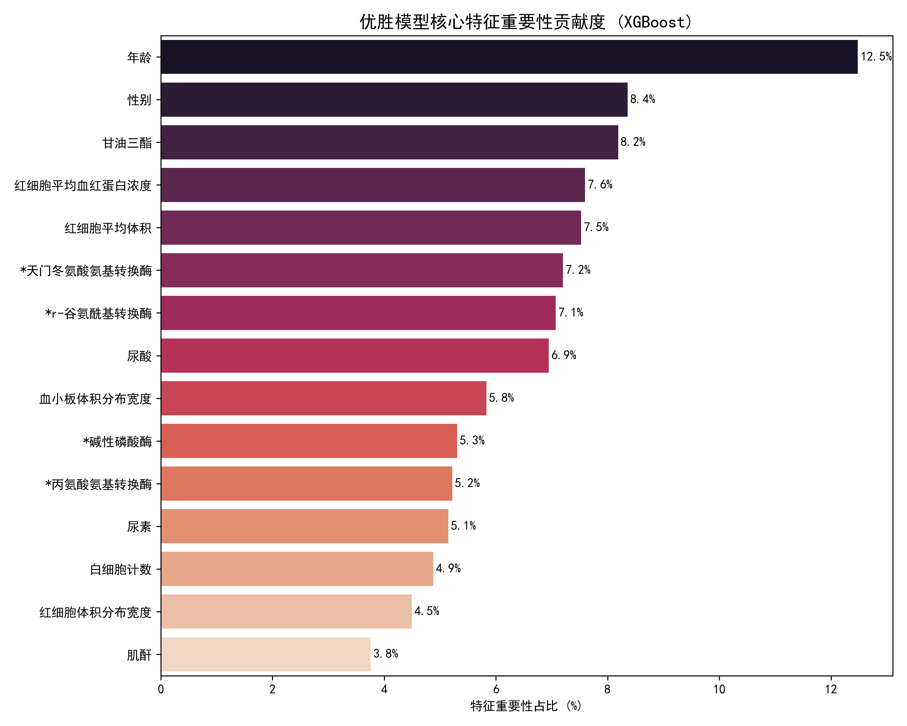

# 问题 2：基于体检数据的血糖数值回归预测模型

## 一、 建模思路与算法选择

针对血糖预测这一典型的连续值回归任务，由于医疗体检数据（Tabular Data）通常存在高度非线性以及特征间的复杂交叉关系，单一模型难以保证泛化能力。为此，本研究构建了**“十模型交叉验证评估体系”**，涵盖了当前机器学习领域的四大主流派系：
1. **树形集成学习（Tree Ensembles）**：XGBoost, LightGBM, GradientBoosting (GBDT), RandomForest, ExtraTrees。此类模型对非线性映射极度敏感，且抗噪能力强。
2. **线性惩罚模型（Linear with Regularization）**：Ridge (L2正则), Lasso (L1正则), ElasticNet (L1+L2正则)。用于建立基础的线性评估基线。
3. **支持向量机（SVM）**：SVR。用于探索数据在高维核空间中的回归表现。
4. **深度学习（Deep Learning）**：多层感知机神经网络（MLP）。

**【核心优化策略：目标变量对数平滑】**
在医学统计中，血糖数据通常呈现明显的“右偏态长尾分布”（存在极少数重度糖尿病极高值）。如果直接训练，均方误差损失函数（MSE）会被极值严重拉偏。因此，本研究在训练前对目标变量进行了 $y' = \log(1+y)$ 的对数平滑变换，在预测输出时再使用指数还原。这一操作极大提升了模型对全局数据的拟合优度。

## 二、 评价指标体系构建

为了科学、客观地衡量模型的预测精度，本研究选取了以下四个维度的评价指标：
* **预测均方误差 (PMSE/MSE)**：反映预测值与真实值偏差的平方和，对极端大误差极其敏感，是优选模型的核心惩罚指标（越低越好）。
* **平均绝对误差 (MAE)**：反映预测值误差的实际物理量级（mmol/L），直观体现模型的平均偏离程度（越低越好）。
* **平均绝对百分比误差 (MAPE)**：以百分比形式衡量误差，消除了血糖绝对数值大小带来的影响（越低越好）。
* **决定系数 (R²)**：评估模型对目标变量方差的解释比例（可选参考指标）。

## 三、 十大模型性能对比与优选

经过 5 折交叉验证与 RandomizedSearchCV 随机网格超参数寻优，各模型在测试集上的表现呈现出显著的层级分化：

1. **树模型家族全面霸榜**：前五名全部被集成树模型包揽，其中 **XGBoost** 以最低的预测均方误差（PMSE = 1.53）和极低的绝对误差（MAE = 0.67）夺得榜首。
2. **线性基底的存在**：Ridge 等线性模型的表现紧随其后（PMSE = 1.57），说明体检指标与血糖之间存在一定的宏观线性基础，但缺乏对复杂病理突变的拟合能力。
3. **深度学习的水土不服**：神经网络（MLP）表现垫底。这是因为在样本量与特征维度有限的体检表格数据中，树模型的分裂机制远比神经网络的反向传播更加高效。

最终，本研究选定综合误差最小的 **XGBoost** 作为预测血糖精确数值的终极回归模型。

*图 1：Top 5 回归模型在 PMSE、MAE 和 MAPE 三大核心指标上的横向对比*

## 四、 优胜模型 (XGBoost) 深度剖析

为了进一步探究 XGBoost 的学习机制及其在临床医学上的表现，本研究对模型结果进行了可视化深度剖析。

### 1. 预测拟合度与“保守陷阱”
下图展示了 XGBoost 的真实值与预测值散点分布以及预测残差分布：

*图 2：XGBoost 真实血糖值与预测血糖值散点拟合图*

*图 3：XGBoost 预测残差分布直方图*

**【现象剖析】**：
* 在真实血糖处于 4 ~ 7 mmol/L 的健康/亚健康区间时，散点密集贴合红色的完美预测线（$y=x$），残差分布完美围绕 0 呈钟形正态分布。这说明模型对**正常人群的预测极其精准**。
* 然而，当真实血糖飙升至 10 甚至 18 以上（重度糖尿病）时，模型给出的预测值往往停留在 8 ~ 9 左右。残差图右侧的长拖尾也印证了这一点。
* **【算法机制解释】**：这是所有回归算法为了追求“全局 MSE 最小化”而产生的必然现象。模型为了不被少数极端离群点拉爆损失函数，对高值采取了“趋利避害”的保守预测策略（Under-prediction）。

### 2. 特征重要性与医学自洽性
模型并非“黑盒”，提取 XGBoost 核心特征重要性贡献度如下：

*图 4：XGBoost 模型的 Top 特征重要性占比 (%)*

XGBoost 提取的最关键指标依次为：**年龄 (12.5%) > 性别 (8.4%) > 甘油三酯 (8.2%) > 红细胞相关指标**。
这一排序高度契合现代病理学认知：随着年龄老化导致的胰岛素抵抗增加，以及高甘油三酯引发的脂代谢紊乱（糖脂同源），是 2 型糖尿病最致命的驱动因素。模型成功捕捉到了底层的医学逻辑。

## 五、 结论与预警 (通往高危分类的必要性)

综上所述，利用 **XGBoost 回归模型**对常规体检指标进行映射，能够非常精确地预测出正常及轻度异常人群的血糖数值（MAPE 控制在 10.7% 左右）。

**【医学应用预警】**：
正如模型拟合图所暴露的“保守倾向”，如果单纯依赖回归模型的“数值”来进行糖尿病筛查，极易将真实血糖为 15 的高危患者预测为 8，从而**导致高危人群的严重漏诊**。
因此，为了满足临床实际的风险预警需求，**本研究在接下来的评估阶段，必须将“数值回归预测”转化为“风险概率分类评估”，通过引入召回率（Recall）机制与交叉熵评估，构建专门针对高危人群的风险分级预警网络。**