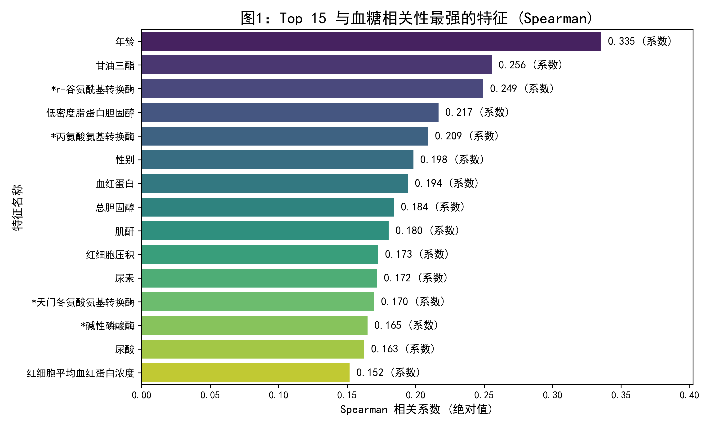
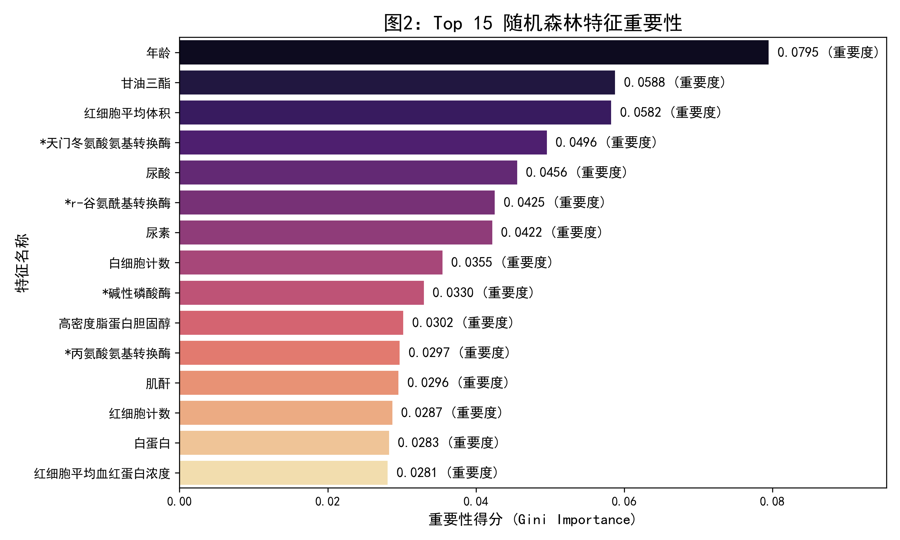
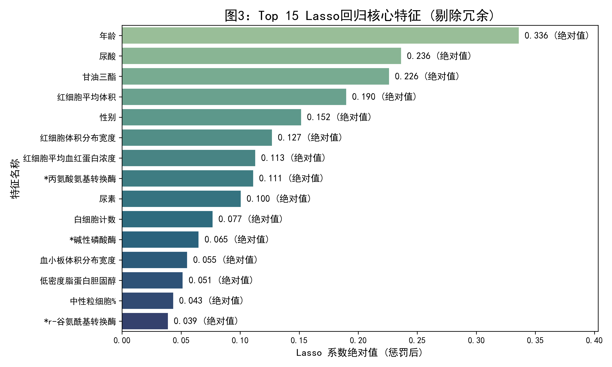
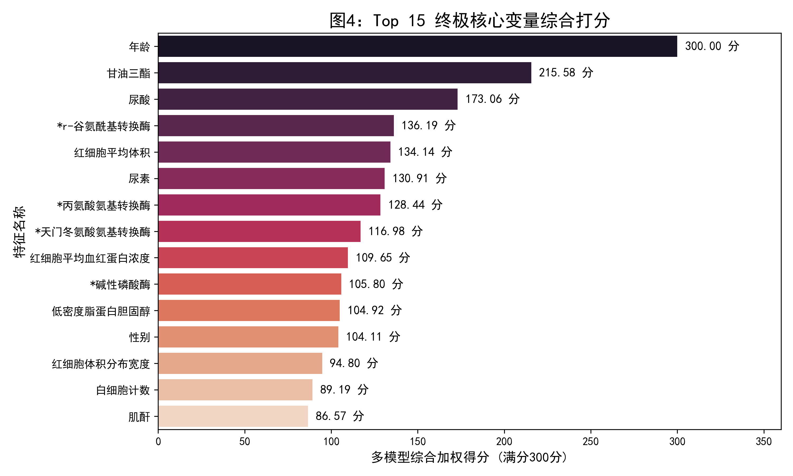

# 问题 1：主要变量指标的筛选过程及其合理性分析

## 一、 筛选过程与建模思路 (多维度集成评估策略)
在医疗健康领域，生理指标之间往往存在复杂的非线性关系与多重共线性。单一的特征筛选方法容易陷入局部最优或丢失高维信息。因此，本研究构建了**“过滤法(Filter) + 嵌入法(Embedded) + 惩罚法(Penalty)”的三维集成特征筛选模型**，具体过程如下：

1. **非线性相关性度量（Spearman 秩相关系数）**：
   采用 Spearman 秩相关系数计算各体检指标与“血糖”的单调映射关系，评估变量间的统计学直接关联强度，并对长尾分布的医疗异常值具有良好的鲁棒性。
2. **树模型特征重要性评估（Random Forest）**：
   构建随机森林回归模型，利用基尼不纯度（Gini Impurity）和袋外误差（OOB Error）评估各特征在决策树节点分裂时对血糖预测的纯度提升贡献，有效捕捉变量与血糖间的复杂非线性关系。
3. **Lasso 回归正则化剔除（L1 惩罚项）**：
   对特征矩阵进行标准化后构建 Lasso 回归模型。通过交叉验证（CV=5）寻找最佳惩罚系数 $\alpha$。Lasso 的 L1 正则化能够将冗余特征与强共线性特征的回归系数强行压缩至 0，实现高维数据的自动降维与核心变量提取。

**终极归一化打分**：
由于上述三种算法的量纲与评估尺度不同，本研究采用 Min-Max 归一化将各项得分映射至 `[0, 100]` 区间，并赋予等权重进行加权求和，得到各项指标的“综合总分”（满分 300 分）。

## 二、 主要变量筛选结果
经过集成模型的量化计算，从初始的 40 余个特征中，筛选出综合总分排名前 15 的核心指标作为预测血糖和评估糖尿病风险的主要变量：

| 排名 | 特征名称 | 综合总分 | 医学分类 |
| :--- | :--- | :--- | :--- |
| 1 | 年龄 | 300.00 | 自然信息 |
| 2 | 甘油三酯 | 215.58 | 脂代谢 |
| 3 | 尿酸 | 173.06 | 肾功能与代谢 |
| 4 | *r-谷氨酰基转换酶 | 136.19 | 肝功能 |
| 5 | 红细胞平均体积 | 134.14 | 血常规 |
| 6 | 尿素 | 130.91 | 肾功能 |
| 7 | *丙氨酸氨基转换酶 | 128.44 | 肝功能 |
| 8 | *天门冬氨酸氨基转换酶 | 116.98 | 肝功能 |
| 9 | 红细胞平均血红蛋白浓度 | 109.65 | 血常规 |
| 10 | *碱性磷酸酶 | 105.80 | 肝功能 |
| 11 | 低密度脂蛋白胆固醇 | 104.92 | 脂代谢 |
| 12 | 性别 | 104.11 | 自然信息 |
| 13 | 红细胞体积分布宽度 | 94.80 | 血常规 |
| 14 | 白细胞计数 | 89.19 | 免疫与炎症 |
| 15 | 肌酐 | 86.57 | 肾功能 |

## 三、 特征筛选的合理性分析 (临床医学视角的交叉验证)
从集成算法筛选出的 Top 15 指标来看，数据驱动的数学模型与临床病理学规律实现了高度统一，证明了筛选过程的科学性与合理性：

1. **核心驱动因素（年龄与脂代谢）**：
   “年龄”以满分高居榜首。随着年龄增长，胰岛 $\beta$ 细胞功能生理性衰退且胰岛素抵抗加重，是2型糖尿病的最核心独立危险因素。紧随其后的“甘油三酯”和“低密度脂蛋白胆固醇”是代谢综合征的标志，脂毒性会直接损害胰岛素信号传导路径。
2. **肝脏糖代谢枢纽（肝功能指标群）**：
   榜单中密集出现了 4 项肝酶指标（r-谷氨酰基转换酶、ALT、AST、ALP）。肝脏是人体维持血糖稳态的核心器官，脂肪肝等肝功能异常往往早于糖尿病确诊出现。模型精准捕捉到了“肝病-糖代谢受损”这一重要临床路径。
3. **肾脏与微血管并发症预警（肾功能指标群）**：
   尿酸、尿素和肌酐的高位入选非常合理。高尿酸血症不仅与胰岛素抵抗强相关，且糖尿病初期往往伴随高滤过性肾损伤，导致尿素与肌酐水平的微小改变。
4. **慢性炎症与血液携氧（血常规指标群）**：
   2型糖尿病本质上是一种低度慢性炎症状态（由白细胞计数反映）。同时，高血糖引起的糖化血红蛋白升高和红细胞微环境改变，被模型通过红细胞平均体积（MCV）等极细微的血常规特征成功捕捉。

综上所述，本模型筛选出的主要变量不仅在数学统计上具有最高的信息增益，更在病理学上构成了“肝-肾-代谢-炎症”的完整糖尿病风险评价网络，具有极高的合理性。